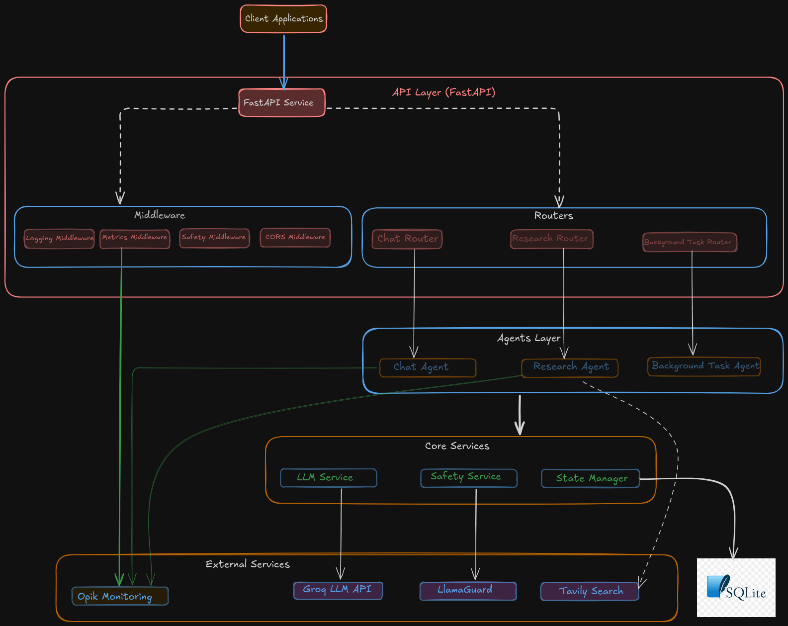
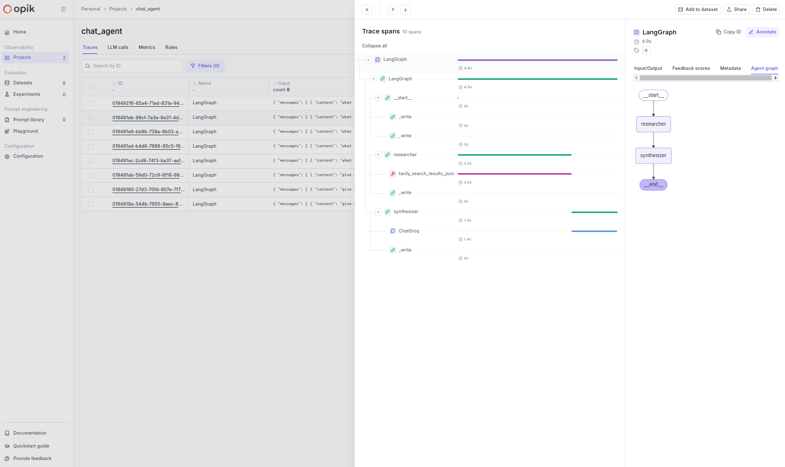

# Shantagent

A sophisticated chatbot system built using LangChain, FastAPI, and various LLM providers. The system supports multiple conversation modes, including basic chat, research capabilities, and background task processing.

## Architecture



The system is built with a modular architecture consisting of several key components:

- **API Layer**: FastAPI-based service with middleware for logging, metrics, safety, and CORS
- **Agents**: Specialized agents for different conversation types (Chat, Research, Background Tasks)
- **Core Services**: LLM integration, safety checks, and state management
- **External Services**: Integration with Groq, LlamaGuard, Tavily Search, and Opik monitoring

## Features

- Multiple conversation modes
  - Basic chat with history management
  - Research mode with web search capabilities
  - Background task processing
- Real-time streaming responses
- Content safety checks using LlamaGuard
- Comprehensive monitoring with Opik
- State persistence using SQLite
- Support for multiple LLM providers

## Prerequisites

- Python 3.11 or higher
- Poetry for dependency management
- Docker and Docker Compose (for running Opik)
- Groq API key
- Tavily API key (for research capabilities)

## Installation

1. Clone the repository:
```bash
git clone https://github.com/yourusername/shantagent.git
cd shantagent
```

2. Install dependencies using Poetry:
```bash
poetry install
```

3. Copy the example environment file and fill in your credentials:
```bash
cp .env.example .env
```

4. Configure your `.env` file with these settings:
```env
GROQ_API_KEY=your-groq-api-key-here
HOST=0.0.0.0
PORT=8000
AUTH_SECRET=prashant122
DEBUG=false
DEFAULT_MODEL=mixtral-8x7b-32768
MODEL_TEMPERATURE=0.7
MAX_TOKENS=2048

# Opik Configuration
OPIK_URL_OVERRIDE=http://localhost:5173/api
OPIK_WORKSPACE=default
OPIK_PROJECT_NAME=chat_agent
OPIK_TRACK_DISABLE=false
OPIK_CHECK_TLS_CERTIFICATE=false
OPIK_DEFAULT_FLUSH_TIMEOUT=30

TAVILY_API_KEY=your-tavily-api-key-here
```

## Running the Application

### Local Development

1. Start the FastAPI server:
```bash
poetry run python run.py
```

2. Access the API documentation at `http://localhost:8000/docs`

### Docker Deployment

1. Build and run using Docker Compose:
```bash
docker-compose -f docker/docker-compose.yml up --build
```

## Setting up Opik Monitoring

1. Clone the Opik repository:
```bash
git clone https://github.com/comet-ml/opik.git
```

2. Navigate to the docker-compose directory:
```bash
cd opik/deployment/docker-compose
```

3. Build and start the Opik services:
```bash
docker compose build
docker compose up -d
```

If you encounter issues with the default docker-compose configuration, use this optimized version:

```yaml
version: "3.8"  # Adding explicit version
services:
  mysql:
    image: mysql:8.4.2
    hostname: mysql
    ports:
        - "3307:3306"
    environment:
      MYSQL_ROOT_PASSWORD: opik
      MYSQL_DATABASE: opik
      MYSQL_USER: opik
      MYSQL_PASSWORD: opik
    healthcheck:
      test: [ "CMD", "mysqladmin", "ping", "-h", "127.0.0.1", "--silent" ]
      timeout: 1s
      interval: 1s
      retries: 300
    volumes:
      - mysql:/var/lib/mysql
  redis:
    image: redis:7.2.4-alpine3.19
    hostname: redis
    ports:
      - "6380:6379"  # Changed to use port 6380 on the host
    command: redis-server --requirepass opik
    healthcheck:
      test: [ "CMD", "nc", "-z", "localhost", "6379" ]
      interval: 2s
      timeout: 4s
      retries: 20
      start_period: 30s
  clickhouse:
    image: clickhouse/clickhouse-server:24.3.6.48-alpine
    hostname: clickhouse
    environment:
      CLICKHOUSE_DB: opik
      CLICKHOUSE_USER: opik
      CLICKHOUSE_PASSWORD: opik
      CLICKHOUSE_DEFAULT_ACCESS_MANAGEMENT: "1"
    volumes:
      - clickhouse:/var/lib/clickhouse
      - clickhouse-server:/var/log/clickhouse-server
    healthcheck:
      test: [ "CMD", "wget", "--spider", "-q", "http://127.0.0.1:8123/ping" ]
      interval: 1s
      timeout: 1s
      retries: 300
  backend:
    image: ghcr.io/comet-ml/opik/opik-backend:${OPIK_VERSION:-latest}
    build:
      context: ../../apps/opik-backend
      dockerfile: Dockerfile
      args:
        OPIK_VERSION: ${OPIK_VERSION:-latest}
    hostname: backend
    command: [ "bash", "-c", "./run_db_migrations.sh && ./entrypoint.sh" ]
    environment:
      DOCKER_BUILDKIT: "1"
      STATE_DB_PROTOCOL: "jdbc:mysql://"
      STATE_DB_URL: "mysql:3306/opik?createDatabaseIfNotExist=true&rewriteBatchedStatements=true"
      STATE_DB_DATABASE_NAME: opik
      STATE_DB_USER: opik
      STATE_DB_PASS: opik
      ANALYTICS_DB_MIGRATIONS_URL: "jdbc:clickhouse://clickhouse:8123"
      ANALYTICS_DB_MIGRATIONS_USER: opik
      ANALYTICS_DB_MIGRATIONS_PASS: opik
      ANALYTICS_DB_PROTOCOL: "HTTP"
      ANALYTICS_DB_HOST: "clickhouse"
      ANALYTICS_DB_PORT: "8123"
      ANALYTICS_DB_USERNAME: opik
      ANALYTICS_DB_DATABASE_NAME: opik
      JAVA_OPTS: "-Dliquibase.propertySubstitutionEnabled=true"
      REDIS_URL: "redis://:opik@redis:6379/"
      ANALYTICS_DB_PASS: opik
      OPIK_OTEL_SDK_ENABLED: "false"
      OTEL_VERSION: "2.9.0"
      OTEL_PROPAGATORS: "tracecontext,baggage,b3"
      OTEL_EXPERIMENTAL_EXPORTER_OTLP_RETRY_ENABLED: "true"
      OTEL_EXPORTER_OTLP_METRICS_DEFAULT_HISTOGRAM_AGGREGATION: "BASE2_EXPONENTIAL_BUCKET_HISTOGRAM"
      OTEL_EXPERIMENTAL_RESOURCE_DISABLED_KEYS: "process.command_args"
      OTEL_EXPORTER_OTLP_METRICS_TEMPORALITY_PREFERENCE: "delta"
      OPIK_USAGE_REPORT_ENABLED: "${OPIK_USAGE_REPORT_ENABLED:-true}"
    ports:
      - "3003:3003"
    depends_on:
      mysql:
        condition: service_healthy
      clickhouse:
        condition: service_healthy
  frontend:
    image: ghcr.io/comet-ml/opik/opik-frontend:${OPIK_VERSION:-latest}
    build:
      context: ../../apps/opik-frontend
      dockerfile: Dockerfile
    hostname: frontend
    ports:
      - "5173:5173"
    extra_hosts:
      - "apihost:host-gateway"
    volumes:
      - ./nginx_default_local.conf:/etc/nginx/conf.d/default.conf
    depends_on:
      backend:
        condition: service_started
networks:
  default:
volumes:
  clickhouse:
  clickhouse-server:
  mysql:
```

This configuration includes:
- MySQL 8.4.2 with proper health checks
- Redis 7.2.4 with password protection
- ClickHouse 24.3.6.48 for analytics
- Configured service dependencies
- Volume management for data persistence
- Network settings for service communication

## API Endpoints

### Chat Endpoints
- `POST /v1/chat`: Basic chat interaction
- `POST /v1/chat/stream`: Streaming chat responses
- `GET /v1/chat/history/{thread_id}`: Retrieve chat history
- `POST /v1/chat/new`: Create new chat thread

### Research Endpoints
- `POST /v1/research`: Research-based chat
- `POST /v1/research/stream`: Streaming research responses
- `GET /v1/research/history/{thread_id}`: Get research history
- `GET /v1/research/status/{thread_id}`: Check research status

### Background Task Endpoints
- `POST /v1/background-task`: Process background tasks
- `POST /v1/background-task/stream`: Stream task progress

### System Endpoints
- `GET /health`: System health check
- `GET /metrics`: Prometheus metrics
- `GET /info`: Service information

## Monitoring and Metrics

The system provides comprehensive monitoring through:
- Prometheus metrics exposed at `/metrics`
- Opik integration for detailed tracing
- Logging middleware for request/response tracking
- System health monitoring

## Security

- Content safety checks using LlamaGuard
- Authentication using bearer tokens
- CORS middleware for access control
- Input validation using Pydantic models

## License

This project is licensed under the MIT License - see the [LICENSE](LICENSE) file for details.


## Opik Monitoring Visualization

Once you have Opik set up and running, you can access the monitoring dashboard to visualize your application's performance and traces. Here's how the Opik monitoring interface looks:



The Opik dashboard provides:
- Detailed request tracing
- Performance metrics visualization
- Agent behavior monitoring
- System resource usage
- Real-time monitoring capabilities

You can access the Opik dashboard at `http://localhost:5173` after setting up the monitoring stack.
